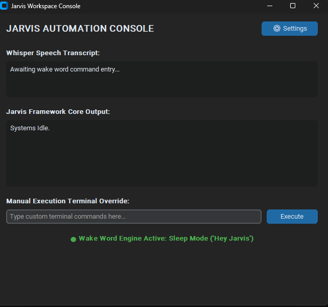
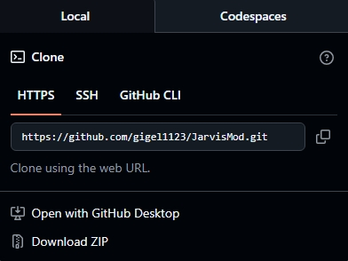
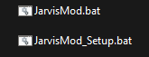
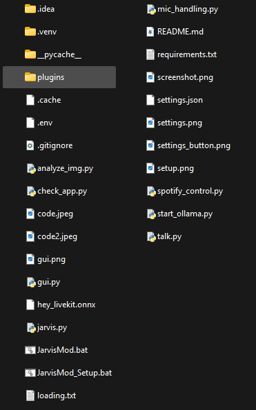
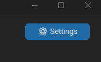
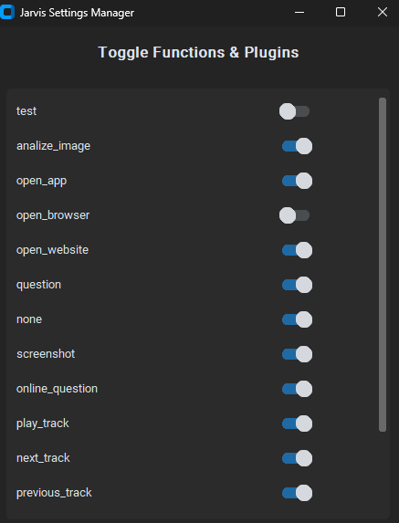

# JarvisMod 🤖



A lightweight, user-friendly voice assistant built for ultimate flexibility and community-driven customization. JarvisMod features a modular core that allows developers and users to easily create, install, and share custom plugins.

---

## 🚀 Features

* **Modular Core:** Built from scratch to be minimal, fast, and completely unbloated.
* **Plugin-Focused Architecture:** Easily extend capabilities by dropping Python scripts into the `plugins/` directory.
* **Voice & GUI Driven:** Combines local voice processing with an intuitive user interface.
* **Local First:** Optimized to work efficiently using local tools and minimal API dependencies.

---

## 🛠️ Project Structure

* `jarvis.py` — The core logic, handling voice processing and orchestration.
* `gui.py` — The user interface layout and styling.
* `plugins/` — The dedicated folder where all custom and community plugins live.
* `mic_handling.py` & `talk.py` — Audio input and speech synthesis utilities.

---

## 🚀 Easy 1-Click Installation

1. **Download JarvisMod:** Click the green **Code** button at the top right of this page and select **Download ZIP**.

   

   

2. **Extract the ZIP:** Extract the folder to your Desktop.
3. **Run Setup:** Double-click **`JarvisMod_Setup.bat`**. It will automatically check for Python, install it if it's missing, configure your environment, and clean itself up.

   

Once finished, just double-click **`JarvisMod.bat`** to start talking to Jarvis!

---

## 🧩 Installing Community Plugins

Adding new capabilities to your assistant takes seconds:

1. Download a community-made plugin file (e.g., `weather_plugin.py`).
2. Drop the `.py` file straight into the `plugins/` folder inside your Jarvis directory.

   

3. Restart Jarvis.
4. Click the settings button and enable the plugin!

   

   

---

## 🔌 Custom Plugin Template For Developers

To build a new plugin for JarvisMod, create a blank Python file in the `plugins/` directory (e.g., `my_plugin.py`) and copy/paste this boilerplate code. Just fill in your metadata and logic!

```python
"""
# PLUGIN TEMPLATE

# 1. The action name Jarvis and Llama 3 will use in the JSON payload
PLUGIN_NAME = "test_print"

# 2. The instruction injected into the AI's system prompt telling it when to use this
PLUGIN_DESC = '"test_print" (no arguments. Use this function when the user explicitly asks to run a test or check if plugins are working)'

# 3. The actual function Jarvis executes when the action matches
def run():
    # VERY IMPORTANT!
    # TO MAKE JARVIS TALK YOU NEED TO IMPORT TALK
    # TO TALK WRITE 'talk.jarvis("text")'
    import talk
    
    # Print to your console terminal
    print("\n[PLUGIN SUCCESS] The dynamic drop-in test plugin was called successfully!")
    
    # Make Jarvis speak to confirm it works
    talk.jarvis("The test plugin executed successfully, sir! Everything is working perfectly.")
    
    return "test plugin executed successfully"
"""
```
---

---

## 🤝 How to Submit Plugins to the Community

While I will continue making plugins myself, JarvisMod relies heavily on the creativity of the community! Anyone can create and share a plugin using the template above. 

To officially add your plugin to our community repository, follow these steps:

1. **Fork the Repository:** Create a copy of this repository to your own GitHub account.
2. **Add Your File:** Place your completed and fully tested plugin script (`.py`) inside the `plugins/` directory.
3. **Open a Pull Request (PR):** Submit a Pull Request from your fork back to our main branch. Please include a short description of what your plugin does in your PR notes.
4. **Request a Review:** Once your PR is open, tag it for review. 

> ⏳ **Please Note:** As a solo developer, I review every plugin manually to ensure code safety, performance, and stability for all users. The review and approval process **can take up to 24 hours**. 

---

## 💙 Community & Recognition

Anyone who submits a plugin or helps maintain this project will receive full credit and recognition in our repository! 

As a solo developer, I want to say a massive thank you to everyone who helps build, test, and grow JarvisMod. Your support means everything!
